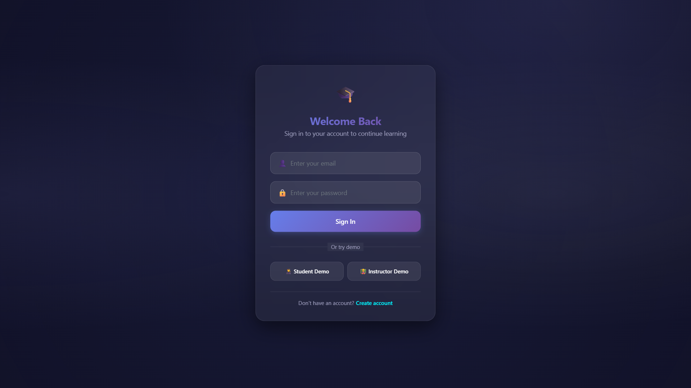

# Project Documentation

## Signup Page

## Login Page

## Student Dashboard Page

## My Enrollments Page

## Student Profile Page

## Instructor Dashboard

## Instructor Courses

## Instructor Profile

## Test Page

## Test Result

## Certificate

